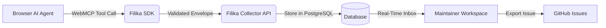

<p align="center">
  
</p>

<h1 align="center">Filika</h1>

<p align="center">
  <strong>WebMCP-native feedback infrastructure: agent discovery, developer triage, and GitHub sync in one place</strong>
</p>

<p align="center">
  <a href="LICENSE"></a>
  <a href="https://bun.sh"></a>
  <a href="https://github.com/Complaintr/filika/actions/workflows/ci.yml"></a>
  <a href="https://github.com/modelcontextprotocol"></a>
  <a href="https://www.typescriptlang.org"></a>
</p>

---

## Table of Contents

- [What is Filika?](#what-is-filika)
- [Features](#features)
- [How It Works](#how-it-works)
- [SDK Installation](#sdk-installation)
- [WebMCP Tool Contract](#webmcp-tool-contract)
- [Developer Triage Workspace](#developer-triage-workspace)
- [Interactive Demo Sandbox](#interactive-demo-sandbox)
- [GitHub Integration](#github-integration)
- [Applications and Access Control](#applications-and-access-control)
- [Authentication and Security](#authentication-and-security)
- [Repository Architecture](#repository-architecture)
- [License](#license)

---

## What is Filika?

Filika is an open-source, WebMCP-native feedback system for modern web applications. When an AI browser agent encounters a bug, a blocked task, confusing UX, or a runtime failure, it uses the static Filika WebMCP tool to draft a structured report. The collector validates and persists the report, and maintainers triage it from a unified workspace or export it directly into GitHub issues.

Agent-authored feedback is transmitted without a user review step. When WebMCP is unavailable or users prefer manual reporting, people can submit feedback directly. Filika provides the feedback workflow and triage infrastructure, remaining completely model-agnostic.

<p align="center">
  
</p>
<p align="center">
  <em>Interactive triage workspace and complaints inbox</em>
</p>

## Features

- **WebMCP native protocol**: Registers the static `filika_submit_feedback` tool using the current `document.modelContext` standard.
- **Privacy and safety by default**: Never collects ambient page content, cookies, credentials, browsing history, or screenshots. Reports contain only the agent's explicit evidence.
- **Multi-category feedback**: Structured capture for `bug`, `blocked_task`, `confusing_behavior`, and `idea` with strict character and payload limits.
- **Interactive triage workspace**: Filter, search, inspect reproduction steps, update status, and manage complaints across multiple applications.
- **GitHub issue export**: Turn agent reports into tracked GitHub issues with formatted markdown, repro steps, and two-way status tracking.
- **Multi-tenant application isolation**: Manage distinct applications with custom slugs, dedicated public SDK keys, and strict website origin allow-lists.
- **Interactive demo sandbox**: Built-in test environment at `/demo` with realistic edge cases to verify WebMCP agent behavior immediately.
- **Production-ready authentication**: Better Auth supporting secure email/password (Resend email verification and password recovery) alongside Google OAuth.
- **Account security and lifecycle**: Complete user account settings including session security and permanent account deletion (`DELETE /api/v1/account`).
- **Self-hostable with Bun and PostgreSQL**: Full-stack TypeScript monorepo built with Bun 1.3.14, Next.js 16, Drizzle ORM, and PostgreSQL 16.

## How It Works



1. **Discovery**: A WebMCP-enabled browser agent interacts with your website and notices an error or blocked flow.
2. **Report**: The agent calls `filika_submit_feedback` with structured title, description, and reproduction steps.
3. **Ingestion**: The collector validates the origin against allowed domains, enforces rate limits, and persists the complaint in PostgreSQL.
4. **Triage and Resolution**: Maintainers inspect the report in the application inbox and export it to GitHub with one click.

## SDK Installation

Embed the lightweight Filika SDK into any web application by adding a script tag to your HTML `<head>` or before `</body>`:

### Production

```html
<script
  src="https://your-filika-host.example/sdk/filika.js"
  data-project-key="app_your_public_application_key"
  data-endpoint="https://your-filika-host.example/api/v1/feedback"
  defer
></script>
```

### Local Development

For local loopback testing over HTTP, use the development bundle:

```html
<script
  src="http://localhost:4173/sdk/filika.development.js"
  data-project-key="app_your_public_application_key"
  data-endpoint="http://localhost:4173/api/v1/feedback"
  defer
></script>
```

### Script Configuration

| Attribute | Required | Description |
| :--- | :--- | :--- |
| `src` | **Yes** | URL to the hosted Filika SDK bundle (`/sdk/filika.js` or `/sdk/filika.development.js`) |
| `data-project-key` | **Yes** | The application's public identifier generated during onboarding |
| `data-endpoint` | **Yes** | The collector feedback ingestion URL (`/api/v1/feedback`) |
| `defer` | **Yes** | Ensures the script executes without blocking initial HTML parsing |

> [!IMPORTANT]
> The collector verifies incoming requests against the application's **Allowed Origins** list configured in `/[appSlug]/settings`. Unlisted website origins are rejected.

## WebMCP Tool Contract

The SDK registers `filika_submit_feedback` with `document.modelContext`. The tool definition, schemas, and descriptions remain completely static to prevent prompt injection.

### Input Schema

| Field | Type | Required | Limits | Description |
| :--- | :--- | :--- | :--- | :--- |
| `kind` | `string` | **Yes** | Enum: `bug`, `blocked_task`, `confusing_behavior`, `idea` | Category of the report |
| `title` | `string` | **Yes** | 1-160 characters | Concise summary of the issue |
| `description` | `string` | **Yes** | 1-4,000 characters | Detailed narrative and observed failure |
| `expectedBehavior` | `string` | No | Up to 2,000 characters | What the agent or user anticipated |
| `reproductionSteps` | `string[]` | No | Max 10 items, 500 chars each | Sequential steps to reproduce the problem |

### Safety and Privacy Bounds

- **Zero ambient capture**: Filika never inspects the DOM, session storage, cookies, user input fields, or network logs outside of explicit tool execution.
- **Closed input schema**: Payloads with unexpected properties are rejected immediately at the collector boundary.
- **Payload limits**: Strict limits on payload size (max 32 KB envelope, 24 KB tool input) prevent denial-of-service or storage exhaustion.

## Developer Triage Workspace

Maintainers review, search, and manage feedback across dedicated workspace views:

| Route | Purpose | Description |
| :--- | :--- | :--- |
| `/[appSlug]/dashboard` | Metrics and Trends | Volume trends, feedback kind distributions, and activity statistics |
| `/[appSlug]/complaints` | Feedback Inbox | Filterable list of reports, detail inspection, and status management |
| `/[appSlug]/settings` | App Configuration | Public SDK key, allowed origins, and data retention rules |
| `/account` | User Settings | Profile identity, session security, and account deletion |

<p align="center">
  
</p>
<p align="center">
  <em>Analytics dashboard: bug frequency, category trends, and resolution metrics</em>
</p>

## Interactive Demo Sandbox

Filika provides a complete, self-contained demo store at `/demo` with intentional edge cases, shopping cart anomalies, and error states. Developers and browser AI agents can test end-to-end feedback submission immediately without needing an external website.

<p align="center">
  
</p>
<p align="center">
  <em>Interactive demo store for testing browser AI agents and tool registration</em>
</p>

## GitHub Integration

Filika connects directly with GitHub to turn verified reports into tracked issues:

1. **Configure credentials**: Provide your GitHub App credentials in `.env` (`GITHUB_APP_ID`, `GITHUB_APP_CLIENT_ID`, `GITHUB_APP_PRIVATE_KEY`, etc.).
2. **Link repository**: Connect your target repository in the application settings panel.
3. **Export issues**: Convert any complaint into a formatted GitHub issue containing full descriptions, reproduction steps, and links back to Filika.

<p align="center">
  
</p>
<p align="center">
  <em>Exporting verified agent reports into structured GitHub issues</em>
</p>

## Applications and Access Control

Filika isolates data by application to support multi-project workflows:

- **Onboarding workflow**: New accounts create an application, specify approved website origins, install the snippet, and send a verification event.
- **Unique slugs**: Application URLs use fixed slugs (e.g. `/[appSlug]/dashboard`). Display names can be updated anytime without breaking bookmarks.
- **Origin verification**: The collector enforces an origin allow-list on every feedback submission. Applications without allowed origins cannot receive reports.
- **Owner authorization**: All read and write APIs require an active owner session; historical data is never exposed publicly.

## Authentication and Security

Filika includes production-grade authentication powered by Better Auth:

- **Google OAuth**: One-click authentication with Google OAuth credentials.
- **Email and Password**: Secure credential login with Resend email delivery. Email signup requires verification before login; verification links expire after one hour.
- **Password Recovery**: The `/forgot-password` route generates single-use reset links valid for 30 minutes, revoking existing sessions upon completion.
- **Account Deletion**: Users can permanently delete their account and all associated applications, feedback records, and tokens via `DELETE /api/v1/account` with typed confirmation.

## Repository Architecture

```text
filika/
├── apps/
│   └── web/            # Next.js 16 host UI, maintainer workspace, and landing page
├── packages/
│   ├── sdk/            # Browser SDK and WebMCP document.modelContext protocol
│   └── collector/      # Feedback API, Drizzle ORM schema, and PostgreSQL persistence
└── tests/
    └── e2e/            # Playwright end-to-end browser integration suite
```

## License

Distributed under the [Apache-2.0](LICENSE) License. Copyright &copy; 2026 Complaintr.
