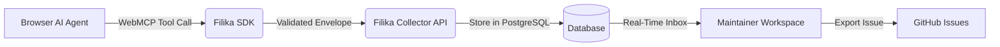

<p align="center">
  
</p>

<h1 align="center">Filika</h1>

<p align="center">
  <strong>WebMCP-native feedback infrastructure: agent discovery, developer triage, and GitHub sync in one place</strong>
</p>

<p align="center">
  <a href="LICENSE"></a>
  <a href="https://bun.sh"></a>
  <a href="https://github.com/Complaintr/filika/actions/workflows/ci.yml"></a>
  <a href="https://github.com/modelcontextprotocol"></a>
  <a href="https://www.typescriptlang.org"></a>
</p>

---

## What is Filika?

Filika is an open-source, WebMCP-native feedback system for modern web applications. When an AI browser agent encounters a bug, a blocked task, confusing UX, or a runtime failure, it uses the static Filika WebMCP tool to draft a structured report. The collector validates and persists the report, and maintainers triage it from a unified workspace or export it directly into GitHub issues.

Agent-authored feedback is transmitted without a user review step. When WebMCP is unavailable or users prefer manual reporting, people can submit feedback directly. Filika provides the feedback workflow and triage infrastructure, remaining completely model-agnostic.

<p align="center">
  
</p>
<p align="center">
  <em>Interactive triage workspace and complaints inbox</em>
</p>

## Features

- **WebMCP native protocol**: Registers the static `filika_submit_feedback` tool using the current `document.modelContext` standard.
- **Privacy and safety by default**: Never collects ambient page content, cookies, credentials, browsing history, or screenshots. Reports contain only the agent's explicit evidence.
- **Multi-category feedback**: Structured capture for `bug`, `blocked_task`, `confusing_behavior`, and `idea` with strict character and payload limits.
- **Interactive triage workspace**: Filter, search, inspect reproduction steps, update status, and manage complaints across multiple applications.
- **GitHub issue export**: Turn agent reports into tracked GitHub issues with formatted markdown, repro steps, and two-way status tracking.
- **Multi-tenant application isolation**: Manage distinct applications with custom slugs, dedicated public SDK keys, and strict website origin allow-lists.
- **Interactive demo sandbox**: Built-in test environment at `/demo` with realistic edge cases to verify WebMCP agent behavior immediately.
- **Production-ready authentication**: Better Auth supporting secure email/password (Resend email verification and password recovery) alongside Google OAuth.
- **Account security and lifecycle**: Complete user account settings including session security and permanent account deletion (`DELETE /api/v1/account`).
- **Self-hostable with Bun and PostgreSQL**: Full-stack TypeScript monorepo built with Bun 1.3.14, Next.js 16, Drizzle ORM, and PostgreSQL 16.

## Feedback Flow



1. **Discovery**: A WebMCP-enabled browser agent interacts with your website and notices an error or blocked flow.
2. **Report**: The agent calls `filika_submit_feedback` with structured title, description, and reproduction steps.
3. **Ingestion**: The collector validates the origin against allowed domains, enforces rate limits, and persists the complaint in PostgreSQL.
4. **Triage and Resolution**: Maintainers inspect the report in the application inbox and export it to GitHub with one click.

## Getting Started

### Prerequisites

- [Bun](https://bun.sh) `1.3.14`
- [Docker Compose](https://docs.docker.com/compose/) (PostgreSQL 16)

### Installation and Local Setup

1. **Clone the repository and install dependencies**:

   ```bash
   git clone https://github.com/Complaintr/filika.git
   cd filika
   bun install
   ```

2. **Start the database**:

   ```bash
   docker compose up db -d
   ```

3. **Configure environment variables**:

   ```bash
   cp .env.example .env
   ```

   > [!NOTE]
   > For local development, the default `.env` settings connect to the Docker PostgreSQL container on port `55432`. Set `BETTER_AUTH_SECRET` to a random string.

4. **Run database migrations and seed demo data**:

   ```bash
   bun run db:migrate
   bun run db:seed
   ```

5. **Start the development server**:

   ```bash
   bun run dev
   ```

   Open [http://localhost:4173](http://localhost:4173) in your browser.

> [!TIP]
> Visit [http://localhost:4173/demo](http://localhost:4173/demo) to test agent feedback submission in the built-in sandbox store.

## Commands

| Command | Action | Description |
| :--- | :--- | :--- |
| `bun run dev` | Start dev server | Launches Next.js web application and collector at port `4173` |
| `bun run build` | Build all packages | Compiles `@filika/sdk`, `@filika/collector`, and `@filika/web` |
| `bun run check` | Lint and format check | Runs Biome code checks across the repository |
| `bun run check:fix` | Auto-fix lints | Automatically fixes formatting and safe lint warnings |
| `bun run format` | Format files | Formats all workspace files with Biome |
| `bun run typecheck` | Type check | Validates TypeScript in strict mode across all workspaces |
| `bun run test:unit` | Run unit tests | Executes targeted Bun unit tests |
| `bun run test:browser` | Browser E2E tests | Runs Playwright integration suite in Chromium |
| `bun run db:migrate` | Run migrations | Applies latest Drizzle schema migrations to PostgreSQL |
| `bun run db:seed` | Seed database | Seeds demo project and initial accounts |
| `bun run db:cleanup` | Prune retention | Removes expired feedback records and artifacts |
| `bun run db:reset` | Reset database | Wipes and re-applies all database migrations |

## Client Integration

Embed the lightweight Filika SDK into any web application by adding a script tag to your HTML `<head>` or before `</body>`:

### Production

```html
<script
  src="https://your-filika-host.example/sdk/filika.js"
  data-project-key="app_your_public_application_key"
  data-endpoint="https://your-filika-host.example/api/v1/feedback"
  defer
></script>
```

### Local Development

For local loopback testing over HTTP, use the development bundle:

```html
<script
  src="http://localhost:4173/sdk/filika.development.js"
  data-project-key="app_your_public_application_key"
  data-endpoint="http://localhost:4173/api/v1/feedback"
  defer
></script>
```

> [!IMPORTANT]
> The collector verifies incoming requests against the application's **Allowed Origins** list configured in `/[appSlug]/settings`. Unlisted origins are rejected.

## WebMCP Tool Contract

The SDK registers `filika_submit_feedback` with `document.modelContext`. The tool definition, schemas, and descriptions remain completely static to prevent prompt injection.

### Input Schema

| Field | Type | Required | Limits | Description |
| :--- | :--- | :--- | :--- | :--- |
| `kind` | `string` | **Yes** | Enum: `bug`, `blocked_task`, `confusing_behavior`, `idea` | Category of the report |
| `title` | `string` | **Yes** | 1-160 characters | Concise summary of the issue |
| `description` | `string` | **Yes** | 1-4,000 characters | Detailed narrative and observed failure |
| `expectedBehavior` | `string` | No | Up to 2,000 characters | What the agent or user anticipated |
| `reproductionSteps` | `string[]` | No | Max 10 items, 500 chars each | Sequential steps to reproduce the problem |

## Workspace Routes

| Route | Purpose | Description |
| :--- | :--- | :--- |
| `/` | Landing page | Feature overview, WebMCP explanation, and quick links |
| `/[appSlug]/dashboard` | Metrics & Analytics | Feedback kind distribution, volume trends, and active stats |
| `/[appSlug]/complaints` | Triage Workspace | Feedback inbox, detailed inspector, and GitHub issue export |
| `/[appSlug]/settings` | App Configuration | Public SDK key, allowed website origins, and data retention |
| `/onboarding` | Guided Setup | Step-by-step application creation and first-report verification |
| `/demo` | Agent Sandbox | Interactive store to test agent WebMCP tool calling |
| `/account` | Account & Security | Session management, password settings, and account deletion |

<p align="center">
  
</p>
<p align="center">
  <em>Analytics dashboard: bug frequency, category trends, and resolution metrics</em>
</p>

## Interactive Demo Sandbox

Filika includes a full e-commerce sandbox environment at `/demo` designed specifically to test browser AI agents and WebMCP tools in action. Agents can browse products, attempt interactions, spot intentional edge cases, and submit reports directly to the collector.

<p align="center">
  
</p>
<p align="center">
  <em>Interactive demo store for testing browser AI agents and tool registration</em>
</p>

## GitHub Integration

Filika connects directly to GitHub to turn verified reports into repository issues:

1. Configure GitHub App credentials in `.env` (`GITHUB_APP_ID`, `GITHUB_APP_CLIENT_ID`, `GITHUB_APP_PRIVATE_KEY`, etc.).
2. Connect your GitHub repository in your application settings.
3. Export complaints to GitHub with complete context, reproduction steps, and links back to Filika.

<p align="center">
  
</p>
<p align="center">
  <em>Exporting verified agent reports into structured GitHub issues</em>
</p>

## Repository Architecture

```text
filika/
├── apps/
│   └── web/            # Next.js 16 host UI, maintainer workspace, and landing page
├── packages/
│   ├── sdk/            # Browser SDK and WebMCP document.modelContext protocol
│   └── collector/      # Feedback API, Drizzle ORM schema, and PostgreSQL persistence
└── tests/
    └── e2e/            # Playwright end-to-end browser integration suite
```

## Verification

Run focused tests locally during development:

```bash
# Lint and format check
bun run check

# Typecheck all packages
bun run typecheck

# Run unit tests
bun run test:unit

# Build all packages
bun run build
```

To run end-to-end browser tests:

```bash
bun run test:browser:prepare
bun run test:browser
```

## License

Distributed under the [Apache-2.0](LICENSE) License. Copyright &copy; 2026 Complaintr.
