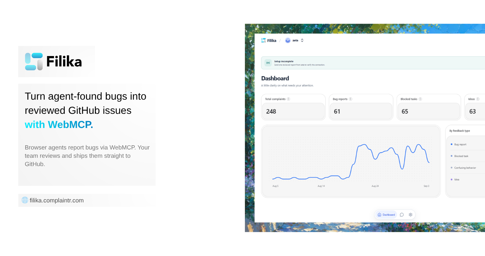

# Local Setup

<p align="left">
  
</p>

This guide provides instructions for setting up the Filika repository for local development and loopback testing.

## Prerequisites

- Bun 1.3.14 or later
- PostgreSQL 16 or later
- Node.js (for tooling compatibility)

## Database Configuration

1. Create a local PostgreSQL database.
2. Copy the example environment file:
   ```bash
   cp .env.example .env
   ```
3. Update `DATABASE_URL` in `.env` to point to your local database instance.

## OAuth and Authentication Setup

To test the full login and integration flow locally, you need to configure OAuth providers:

### Google OAuth
1. Go to the [Google Cloud Console](https://console.cloud.google.com/).
2. Create a new project and configure the OAuth consent screen.
3. Create OAuth 2.0 Client IDs. Add `http://localhost:4173` to Authorized JavaScript origins.
4. Add `http://localhost:4173/api/auth/callback/google` to Authorized redirect URIs.
5. Copy the generated Client ID and Client Secret into your `.env` file under `GOOGLE_CLIENT_ID` and `GOOGLE_CLIENT_SECRET`.

### GitHub OAuth (Login)
1. Go to your GitHub Developer Settings -> OAuth Apps.
2. Create a new OAuth App.
3. Set the Homepage URL to `http://localhost:4173`.
4. Set the Authorization callback URL to `http://localhost:4173/api/auth/callback/github`.
5. Copy the Client ID and Client Secret into your `.env` file under `GITHUB_CLIENT_ID` and `GITHUB_CLIENT_SECRET`.

### GitHub App (Issue Export Integration)
*This is separate from the GitHub OAuth login app.*
1. Go to GitHub Developer Settings -> GitHub Apps.
2. Create a new GitHub App.
3. Set the Homepage URL to `http://localhost:4173`.
4. Set the Callback URL to `http://localhost:4173/api/v1/github/callback`.
5. Set the Webhook URL to `http://localhost:4173/api/v1/github/webhook`.
6. Provide a Webhook Secret and save it as `GITHUB_APP_WEBHOOK_SECRET` in `.env`.
7. Generate a Private Key (PEM) and save its contents as `GITHUB_APP_PRIVATE_KEY` in `.env` (use literal `\n` between lines).
8. Copy the App ID, Client ID, and Client Secret to their respective `GITHUB_APP_*` variables in `.env`.
9. Generate a random 32-byte hex string for `GITHUB_TOKEN_ENCRYPTION_KEY`.

### Email Delivery (Resend)
If you wish to test email verification and password recovery, you need a Resend account.
1. Sign up at [Resend](https://resend.com).
2. Generate an API Key and set it as `RESEND_API_KEY`.
3. Set `AUTH_EMAIL_FROM` to an email address on your verified domain (e.g., `noreply@yourdomain.com`).

## Installation and Startup

1. Install all dependencies using Bun:
   ```bash
   bun install
   ```
2. Run database migrations to set up the schema:
   ```bash
   bun run db:migrate
   ```
3. (Optional) Seed the database with demo data:
   ```bash
   bun run db:seed
   ```
4. Start the development server:
   ```bash
   bun run dev
   ```

The local development server will be available at `http://localhost:4173`. You can access the local test sandbox at `/demo`.
